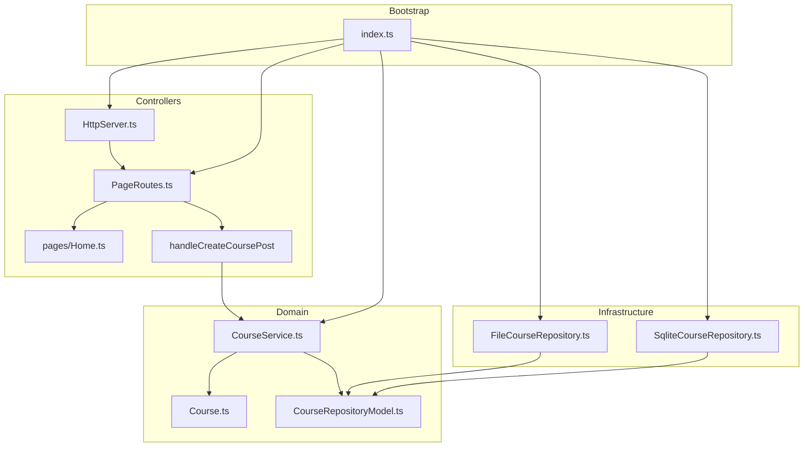

# Documentation du projet restaurant-app-ts

## Présentation de la solution

Ce projet est une **application TypeScript en architecture hexagonale**, conçue comme **modèle pédagogique minimaliste**.  
Il s'agit d'une gestion de restaurant très simple, illustrant la création et la consultation de plats (`Course`) via une interface HTML générée côté serveur.  
L'objectif n'est pas la richesse fonctionnelle, mais la **clarté de la séparation des responsabilités**, afin d'aider un développeur à comprendre les fondements d'une architecture propre.

La solution tourne dans un environnement **Node.js**, avec persistance optionnelle sur **fichier JSON** ou **base SQLite**, et un rendu HTML piloté par des routes simples (`PageRoutes`).

---

## Architecture hexagonale (Hexagonal Architecture)

L'**architecture hexagonale**, aussi connue sous le nom de **Ports & Adapters**, vise à **isoler le cœur métier** des dépendances techniques.  
Le principe est de structurer l'application autour de **trois couches** principales :

- **Le Domaine (Core)** : contient la logique métier pure (entités, interfaces, services). Il ne dépend d’aucune autre couche.

- **Les Adapters (Infrastructure & Interfaces)** : interagissent avec le monde extérieur (base de données, serveur HTTP, UI...).

- **Le Bootstrap (Configuration)** : instancie et connecte les composants au démarrage de l’application.

Dans cette solution :

- Le dossier `domain/` contient les entités et les interfaces du métier.

- Le dossier `infrastructure/` contient les implémentations concrètes des interfaces du domaine (ex: `FileCourseRepository`, `SqliteCourseRepository`).

- Le dossier `controllers/` contient les composants exposés à l’extérieur (serveur HTTP, rendu HTML).

- Le fichier `index.ts` joue le rôle de **bootstrap** et assemble tous les composants.

Ce découpage permet une forte **testabilité**, une bonne **maintenabilité**, et une **indépendance vis-à-vis des frameworks ou des bases de données**.

## Controllers

- `controllers/web/HttpServer.ts`
- `controllers/web/PageRoutes.ts`
- `controllers/web/adapters/CourseAdapter.ts`
- `controllers/web/dto/CourseDTO.ts`
- `controllers/web/handleCreateCoursePost.ts`
- `controllers/web/pages/404.ts`
- `controllers/web/pages/CourseList.ts`
- `controllers/web/pages/CreateCourseForm.ts`
- `controllers/web/pages/Home.ts`

## Domain

- `domain/entities/Course.ts`
- `domain/enums/CourseCategory.ts`
- `domain/factories/CourseFactory.ts`
- `domain/ports/CourseFactoryModel.ts`
- `domain/ports/CourseModel.ts`
- `domain/ports/CourseRepositoryModel.ts`
- `domain/ports/CourseServiceModel.ts`
- `domain/services/CourseService.ts`

## Infrastructure

- `infrastructure/FileCourseRepository/FileCourseRepository.ts`
- `infrastructure/FileCourseRepository/index.ts`
- `infrastructure/SqliteCourseRepository/SqliteCourseRepository.ts`
- `infrastructure/SqliteCourseRepository/index.ts`

## Utils

- `utils/parseFormData.ts`
- `utils/readJson.ts`
- `utils/writeJson.ts`
